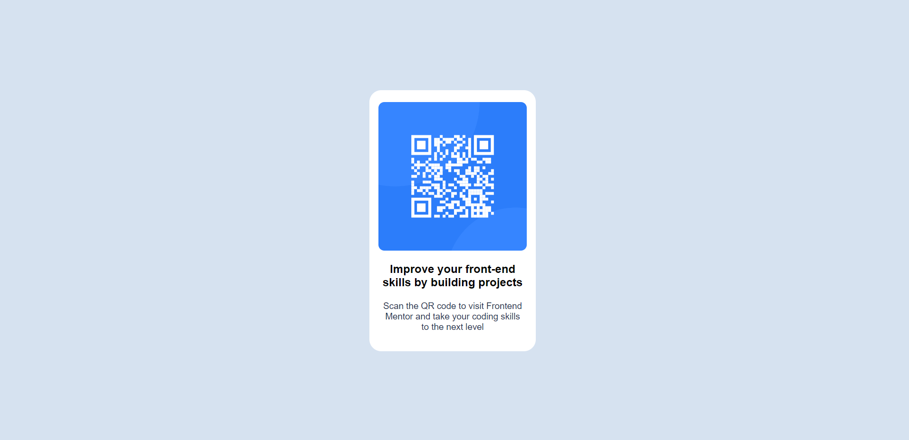

# Frontend Mentor - QR code component solution

This is a solution to the [QR code component challenge on Frontend Mentor](https://www.frontendmentor.io/challenges/qr-code-component-iux_sIO_H). Frontend Mentor challenges help you improve your coding skills by building realistic projects. 

## Table of contents

- [Overview](#overview)
  - [Screenshot](#screenshot)
  - [Links](#links)
- [My process](#my-process)
  - [Built with](#built-with)
- [Author](#author)

## Overview

### Screenshot

### Links

- Solution URL: (https://www.frontendmentor.io/solutions/qr-code-component-solution-with-html-and-css-n1vmhsuJX4)
- Live Site URL: (https://thiago87dev.github.io/qr-code-component/)

## My process

### Built with

- Semantic HTML5 markup
- CSS custom properties
- Flexbox

### Continued development

## Author

- GitHub - [Thiago Alves](https://github.com/Thiago87dev)
- Frontend Mentor - [@MrThiago87](https://www.frontendmentor.io/profile/MrThiago87)
- Instagram - [@thiagopaulista87](https://www.instagram.com/thiagopaulista87/)

